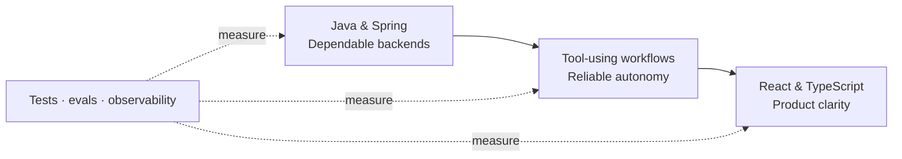

# Levent Can Ceylan

**Final-year Computer Engineering student building depth in backend systems and reliable agentic software.**

Java foundations · Systems thinking · AI workflows that earn autonomy

[Portfolio](https://leventtcaan.github.io/) · [LinkedIn](https://www.linkedin.com/in/leventcanceylan/) · [Email](mailto:ceylanleventcan@gmail.com)

---

### Now

<table>
  <tr>
    <td width="33%" valign="top">
      WORK  
      <strong>Garanti BBVA Technology</strong> 
      Software Engineering Intern in Branch Channel Management, contributing to Mainframe-to-Java modernization.
    </td>
    <td width="33%" valign="top">
      STUDY  
      <strong>Akdeniz University</strong> 
      Final-year Computer Engineering student strengthening systems fundamentals and engineering judgment.
    </td>
    <td width="33%" valign="top">
      DIRECTION  
      <strong>Backend & agentic systems</strong> 
      Dependable services first; measurable, tool-using AI workflows on top; clear product surfaces around them.
    </td>
  </tr>
</table>

### The system I am growing into

This is a direction, not a list of claimed mastery. I am deliberately building the foundations before making the claim.

### What I am deepening

- **Backend systems:** Java, Spring, PostgreSQL, concurrency, event-driven design, testing and observability.
- **Reliable agents:** tool use, durable workflows, evals, human approval, security and failure recovery.
- **Product clarity:** React and TypeScript interfaces that make state, decisions and traces understandable.
- **Computer science:** data structures, algorithms, databases, networking, operating systems and system design.

### Experience trajectory

`CURRENT` **Garanti BBVA Technology** — Software Engineering Intern  
`2 WEEKS` **Garanti BBVA** — Head Office Intern  
`1 MONTH` **Karadeniz Holding** — Mandatory Intern

### Working principles

> Make the system correct before making it clever.  
> Autonomy is useful only when it is measurable.  
> If users cannot understand it, it is not finished.

---

  Open to new-grad software engineering conversations in Türkiye and relocation-friendly teams abroad.

